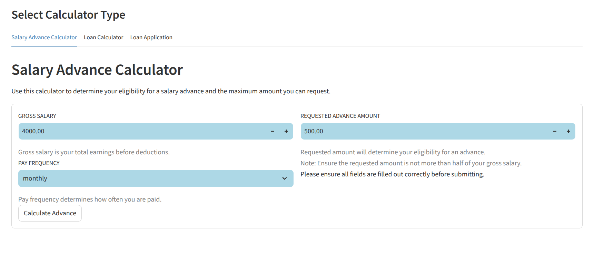
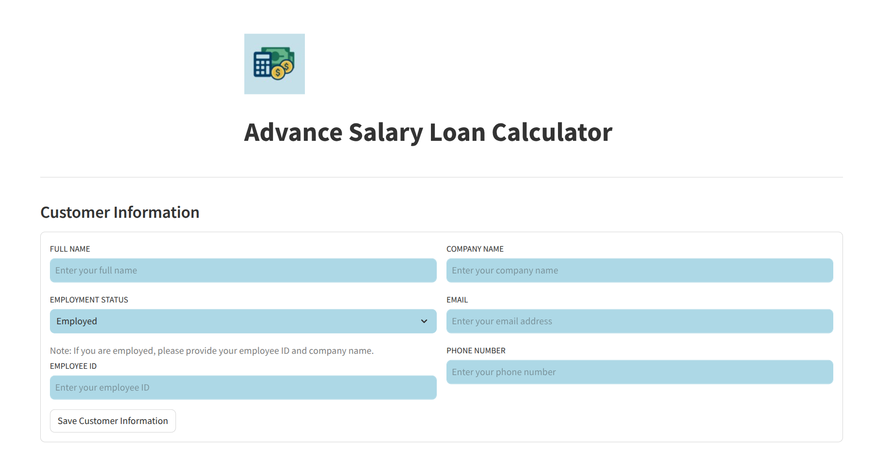

# Advanced Salary Loan Calculator

A microservice-based application that provides salary advance and loan calculations with a modern UI.

## 🏗️ Architecture

The application consists of two main components:
- **Frontend**: Streamlit-based user interface
- **Backend**: FastAPI service with Pandas-powered calculations

## 🚀 Features

- Salary advance calculations
- Loan amount and interest calculations
- Compound interest computations
- Interactive UI with real-time results
- **Loan application with validation questions and payment schedule upload**

## 📸 Screenshots

### Main Interface


### Salary Advance Calculator


### Loan Calculator


## 🛠️ Tech Stack

- **Frontend**: Streamlit
- **Backend**: FastAPI
- **Data Processing**: Pandas
- **Containerization**: Docker & Docker Compose
- **Deployment**: VPS

## 📋 Prerequisites

- Docker
- Docker Compose
- Git

## 🚀 Getting Started

1. Clone the repository:
```bash
git clone <repository-url>
cd Advanced-Salary-Loan-Calculator
```

2. Build and run the containers:
```bash
docker compose up --build
```

3. Access the application:
- Frontend: http://localhost:8501
- Backend API: http://localhost:8000

## 📁 Project Structure

```
Advanced-Salary-Loan-Calculator/
├── .streamlit/
│   └── config.toml
├── front-end/
│   ├── Dockerfile
│   ├── requirements.txt
│   └── app.py
├── backend/
│   ├── Dockerfile
│   ├── requirements.txt
│   ├── main.py
│   ├── customer_info.py
│   ├── loan_application.py
│   ├── loan_calculation.py
│   ├── models.py
│   └── payment_schedule.py
├── docker-compose.yml
├── test-compose.yml
├── .gitignore
├── LICENSE
└── README.md
```

## 🔧 Development

### Frontend Development
- Located in `front-end/`
- Built with Streamlit
- Handles UI and API calls

### Backend Development
- Located in `backend/`
- Built with FastAPI
- Handles calculations and business logic

### Testing
- Use `test-compose.yml` for running tests in an isolated environment
- Run tests using: `docker compose -f test-compose.yml up`

## 📝 API Documentation

### Endpoints

1. `/api/v2/calculate_advance`
   - Calculates salary advance eligibility and amount
   - Input: Salary details, requested amount
   - Output: Eligibility status, maximum advance

2. `/api/v3/calculate_loan`
   - Calculates loan details and interest
   - Input: Loan amount, interest rate, term
   - Output: Total repayable amount, schedule

3. `/api/v5/submit_loan_application`
   - Submits a loan application with applicant details and payment schedule.
   - Input: House ownership, salary deduction approval, number of dependents, employment duration, base64 encoded payment schedule CSV.
   - Output: Success message.

## 🚀 Deployment

### Live Demo
Visit the live application at: [https://salaryadvance.duckdns.org](https://salaryadvance.duckdns.org)

### AWS EC2 Deployment

1. **Launch EC2 Instance**
   - Region: Europe (Milan) - eu-south-1
   - Instance Type: t2.micro
   - AMI: Ubuntu 22.04 LTS
   - Security Group: Allow HTTP (80) and HTTPS (443)

2. **Domain Setup**
   - Domain: salaryadvance.duckdns.org
   - DNS: Point to EC2 instance IP

3. **Server Setup**
   ```bash
   # Install dependencies
   sudo apt update
   sudo apt install -y docker.io docker-compose nginx certbot python3-certbot-nginx

   # Add user to docker group
   sudo usermod -aG docker ubuntu
   sudo systemctl restart docker

   # Configure Nginx
   sudo nano /etc/nginx/sites-available/salaryadvance.duckdns.org
   ```

4. **Nginx Configuration**
   ```nginx
   server {
       listen 80;
       server_name salaryadvance.duckdns.org;

       location / {
           proxy_pass http://localhost:8501;
           proxy_http_version 1.1;
           proxy_set_header Upgrade $http_upgrade;
           proxy_set_header Connection 'upgrade';
           proxy_set_header Host $host;
           proxy_cache_bypass $http_upgrade;
       }
   }
   ```

5. **SSL Setup**
   ```bash
   sudo ln -s /etc/nginx/sites-available/salaryadvance.duckdns.org /etc/nginx/sites-enabled/
   sudo nginx -t
   sudo systemctl restart nginx
   sudo certbot --nginx -d salaryadvance.duckdns.org
   ```

6. **Deploy Application**
   ```bash
   # Clone repository
   git clone <repository-url>
   cd Advanced-Salary-Loan-Calculator

   # Start application
   docker-compose up -d
   ```

7. **Access Application**
   - Production URL: https://salaryadvance.duckdns.org
   - SSL Certificate: Auto-renewing Let's Encrypt certificate

### Maintenance

- SSL certificates auto-renew every 90 days
- Monitor application logs: `docker-compose logs -f`
- Update application: `git pull && docker-compose up -d --build`

## 🔐 Security

- API endpoints are protected
- Input validation implemented
- Secure error handling

## 📄 License

This project is licensed under the MIT License - see the LICENSE file for details.
